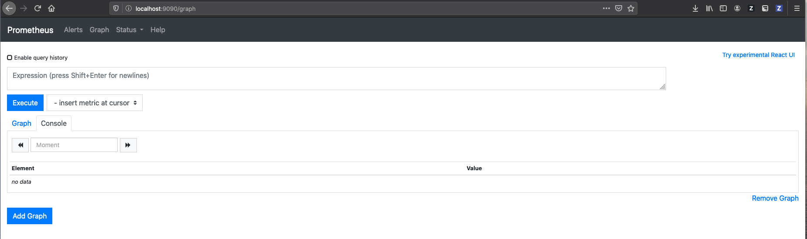
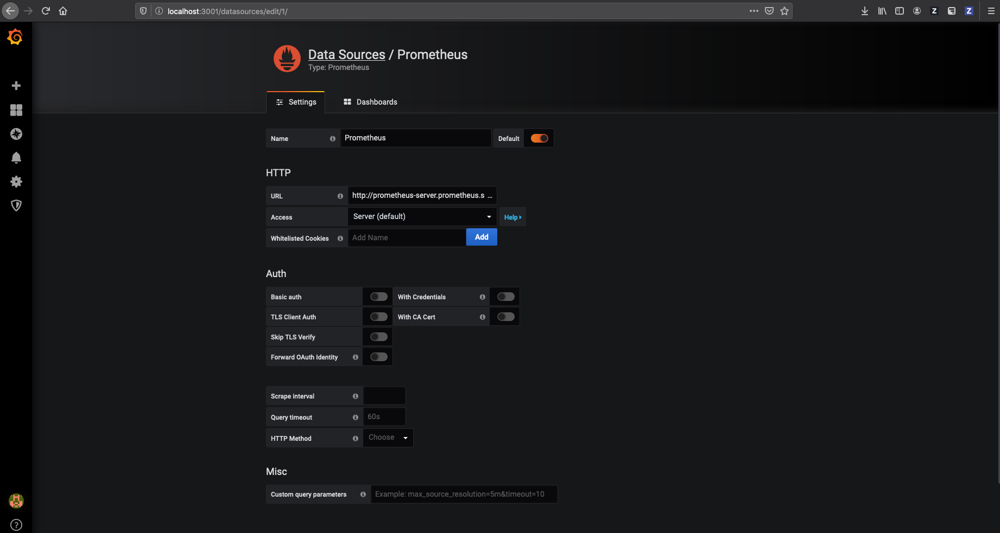
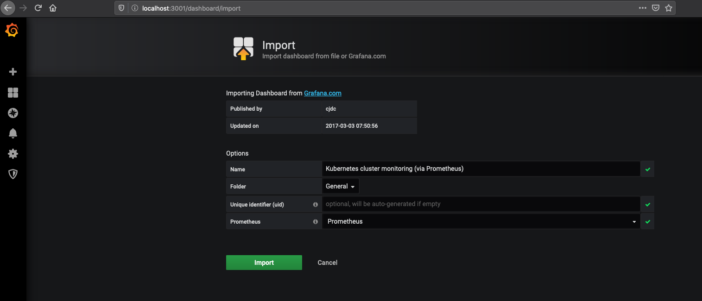
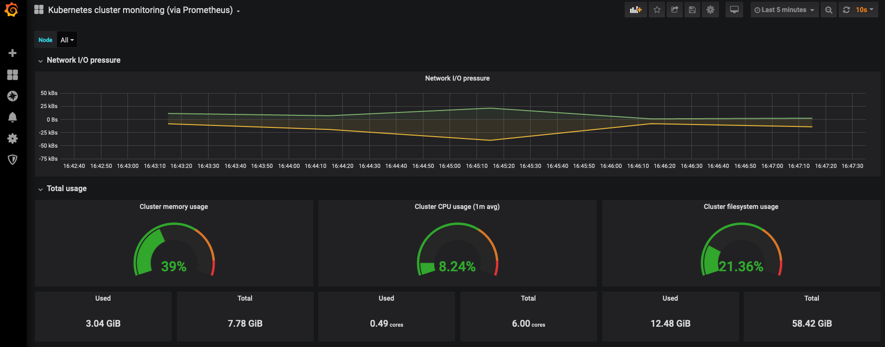

# Node.js in the Cloud

Welcome :wave: to the Node.js in the Cloud workshop!

The workshop provides an introduction to cloud-native development with Node.js by walking you through how to extend an Express.js-based application to leverage cloud capabilities.

**Target Audience:** This workshop is aimed at developers who are familiar with Node.js but want to gain a base understanding of some of the key concepts of cloud-native development with Node.js.

## Extending an application to leverage cloud capabilities

### Building a Cloud-Ready Express.js Application

This will show you how to take a Node.js application and make it "cloud-ready": adding support for Cloud Native Computing Foundation (CNCF) technologies using the package and templates provided by the [NodeShift](https://nodeshift.dev/) project.

In this self-paced tutorial you will:

- Create an Express.js application
- Add logging, metrics, and health checks
- Build your application with Docker
- Package your application with Helm
- Deploy your application to Kubernetes
- Monitor your application using Prometheus

The application you'll use is a simple Express.js application. You'll learn about Health Checks, Metrics, Docker, Kubernetes, Prometheus, Grafana. In the end, you'll have a fully functioning application running as a cluster in Kubernetes, with production monitoring.

The content of this tutorial is based on recommendations from the  [NodeShift Reference Architecture for Node.js](https://github.com/nodeshift/nodejs-reference-architecture).

### Prerequisites

Before getting started, make sure you have the following prerequisites installed on your system.

1. Install [Node.js 14](https://nodejs.org/en/download/) (or use [nvm](https://github.com/nvm-sh/nvm#installation-and-update))
1. Docker and Kubernetes
   - ***On Mac or Windows***: [Docker for Desktop](https://www.docker.com/products/docker-desktop)
   - ***On Linux***: Docker for Desktop is not available, follow the docker for linux instructions below and Kubernetes alternatives are:
    - [minikube](https://kubernetes.io/docs/tasks/tools/install-minikube/)
    - [microk8s](https://microk8s.io/#quick-start)
1. Helm v3 - https://helm.sh/docs/intro/install/
   - **Note**: This workshop tested with Helm v3.4.2

### Setting up

How to start Kubernetes will depend on how you intend to run it.

#### Starting Kubernetes

#### `Docker for Desktop`

Ensure you have installed Docker for Desktop and enabled Kubernetes within the application. To do so:

On macOS:
1. Select the Docker icon in the Menu Bar
2. Click `Preferences/Settings > Kubernetes > Enable Kubernetes`.

On Windows:
1. Select the Docker icon in the notification area of the taskbar.
2. Click `Settings > Kubernetes > Enable Kubernetes`.

It will take a few moments to install and start up. If you already use Kubernetes, ensure that you are configured to use the `docker-for-desktop` cluster. To do so:

1. Select the Docker icon in the Menu Bar
2. Click `Kubernetes` and select the `docker-for-desktop` context

#### Docker on linux

<details>
Install Docker Engine Community using

```sh
sudo apt-get install docker-ce docker-ce-cli containerd.io
```

More information can be found at https://docs.docker.com/install/linux/docker-ce/ubuntu/

Add the user to the docker group (optional for part 1, required for part 2 and 3)

```sh
sudo groupadd docker
sudo gpasswd -a $USER docker
sudo service docker restart
```

Install docker compose

```sh
sudo apt install docker-compose
```

</details>

#### `microk8s`

<details>

```sh
snap install --channel 1.14/stable microk8s --classic
sudo usermod -a -G microk8s ibmuser
sudo microk8s.start
sudo snap alias microk8s.kubectl kubectl
export PATH=/snap/bin:$PATH
sudo microk8s.config >~/.kube/config
microk8s.enable dns registry
```

You may be prompted to add your userid to the 'microk8s' group to avoid having to use `sudo` for all the commands.

**Note**: The Prometheus Helm chart is
[not compatible](https://github.com/helm/charts/pull/17268) with
Kubernetes 1.16, so make sure to install 1.14.

</details>

#### `minikube`

<details>

```sh
minikube start --kubernetes-version=1.14.7
eval $(minikube docker-env)
```

**Note** that the Prometheus Helm chart is
[not compatible](https://github.com/helm/charts/pull/17268) with
Kubernetes 1.16, so make sure to run with 1.14.7.
</details>

#### Installing Helm

Helm is a package manager for Kubernetes. By installing a Helm "chart" into your Kubernetes cluster you can quickly run all kinds of different applications. You can install Helm using one of the options below:

**Using a Package Manager:**

* macOS with Homebrew: `brew install helm`
* Linux with Snap: `sudo snap install helm --classic`
* Windows with Chocolatey: `choco install kubernetes-helm`

**Using a Script:**

```sh
$ curl -fsSL -o get_helm.sh https://raw.githubusercontent.com/helm/helm/master/scripts/get-helm-3
$ chmod 700 get_helm.sh
$ ./get_helm.sh
```

### 1. Create your Express.js Application

The following steps cover creating a base Express.js application. Express.js is a popular web server framework for Node.js.

1. Create a directory to host your project:

   ```sh
   mkdir express-app
   cd express-app
   ```

2. Initialize your project with `npm` and install the Express.js module: 

   ```sh
   npm init --yes
   npm install express
   ```

3. We'll also install the Helmet module. Helmet is a middleware that we can use to set some sensible default headers on our HTTP requests.

   ```sh
   npm install helmet
   ```

4. It is important to add effective logging to your Node.js applications to facilitate observability, that is to help you understand what is happening in your application. The [NodeShift Reference Architecture for Node.js](https://github.com/nodeshift/nodejs-reference-architecture/blob/main/docs/operations/logging.md) recommends using Pino, a JSON-based logger.

   Install Pino:

   ```sh
   npm install pino
   ```

5. Create a file named `server.js`:

   ```sh
   touch server.js
   ```

6. Add the following to `server.js` to produce an Express.js server that responds on the `/` route with 'Hello, World!'. 

   ```js
   const express = require('express');
   const helmet = require('helmet');
   const pino = require('pino')();
   const PORT = process.env.PORT || 3000;

   const app = express();

   app.use(helmet());

   app.get('/', (req, res) => {
      res.send('Hello, World!');
   });

   app.listen(PORT, () => {
      pino.info(`Server listening on port ${PORT}`);
   });
   ```

4. Start your application:

    ```sh
    npm start
    ```

Navigate to [http://localhost:3000](http://localhost:3000) and you should see the server respond with 'Hello, World!'.


### 2. Add Health Checks to your Application

Kubernetes, and a number of other cloud deployment technologies, provide "Health Checking" as a system that allows the cloud deployment technology to monitor the deployed application and to take action should the application fail or report itself as "unhealthy".

The simplest form of Health Check is process level health checking, where Kubernetes checks to see if the application process still exists and restarts the container (and therefore the application process) if it is not. This provides a basic restart capability but does not handle scenarios where the application exists but is unresponsive, or where it would be desirable to restart the application for other reasons.

The next level of Health Check is HTTP based, where the application exposes a "livenessProbe" URL endpoint that Kubernetes can make requests of in order to determine whether the application is running and responsive. Additionally, the request can be used to drive self-checking capabilities in the application.

Add a Health Check endpoint to your Express.js application using the following steps:

1. Register a Liveness endpoint in `server.js`:

   ```js
   app.get('/live', (req, res) => res.status(200).json({ status: 'ok' }));
   ```

 Add this line after the `app.use(helmet());` line. This adds a `/live` endpoint to your application. As no liveness checks are registered, it will return as status code of 200 OK and a JSON payload of `{"status":"UP","checks":[]}`.

Check that your `livenessProbe` Health Check endpoint is running:

2. Start your application:

   ```sh
   npm start
   ```

3. Visit the `live` endpoint [http://localhost:3000/live](http://localhost:3000/live).

For information more information on health/liveness checks, refer to the following:
 - [NodeShift Reference Architecture for Node.js Applications - Health Checks](https://github.com/nodeshift/nodejs-reference-architecture/blob/master/docs/operations/healthchecks.md)
 - [Red Hat Developer Blog on Health Checking](https://developers.redhat.com/blog/2020/11/10/you-probably-need-liveness-and-readiness-probes/?sc_cid=7013a0000026DqpAAE)

### 3. Add Metrics to your Application

For any application deployed to a cloud, it is important that the application is "observable": that you have sufficient information about an application and its dependencies such that it is possible to discover, understand and diagnose the state of the application. One important aspect of application observability is metrics-based monitoring data for the application.

One of the CNCF recommended metrics systems is [Prometheus](http://prometheus.io), which works by collecting metrics data by making requests of a URL endpoint provided by the application. Prometheus is widely supported inside Kubernetes, meaning that Prometheus also collects data from Kubernetes itself, and application data provided to Prometheus can also be used to automatically scale your application.

The `prom-client` package provides a library that auto-instruments your application to collect metrics. It is then possible to expose the metrics on an endpoint for consumption by Prometheus.

Add a `/metrics` Prometheus endpoint to your Express.js application using the following steps:

1. Add the `prom-client` dependency to your project:

   ```sh
   npm install prom-client
   ```

2. Require `prom-client` in `server.js` and choose to configure default metrics:

   ```js
   // Prometheus client setup
   const Prometheus = require('prom-client');
   Prometheus.collectDefaultMetrics();
   ```

    It is recommended to add these lines to around Line 3 below the `pino` logger import.

3. Register a `/metrics` route to serve the data on:

   ```js
   app.get('/metrics', async (req, res, next) => {
   try {
      res.set('Content-Type', Prometheus.register.contentType)
      const metrics = await Prometheus.register.metrics()
      res.end(metrics)
   } catch {
      res.end('')
   }
   })
   ```

Register the `app.get('/metrics')...` route after your `/live` route handler. This adds a `/metrics` endpoint to your application. This automatically starts collecting data from your application and exposes it in a format that Prometheus understands.

Check that your metrics endpoint is running:

1. Start your application:

   ```sh
   npm start
   ```

2. Visit the `metrics` endpoint [http://localhost:3000/metrics](http://localhost:3000/metrics).

For information on how to configure the `prom-client` library see the [prom-client documentation](https://github.com/siimon/prom-client#prometheus-client-for-nodejs---).

You can install a local Prometheus server to graph and visualize the data, and additionally to set up alerts. For this workshop, you'll use Prometheus once you've deployed your application to Kubernetes.

### 4. Building your Application with Docker

Before you can deploy your application to Kubernetes, you first need to build your application into a Docker container and produce a Docker image. This packages your application along with all of its dependencies in a ready-to-run format.

NodeShift provides a "[Docker](https://github.com/NodeShift/docker)" project that provides a number of best-practice Dockerfile templates that can be used to build your Docker container and produce your image.

For this workshop, you'll use the `Dockerfile-run` template, which builds a production-ready Docker image for your application.

Build a production Docker image for your Express.js application using the following steps:

1. Copy the `Dockerfile-run` template into the root of your project:

   ```sh
   curl -fsSL -o Dockerfile-run https://raw.githubusercontent.com/NodeShift/docker/master/Dockerfile-run
   ```

2. Copy the `.dockerignore` file into the root of your project:

   ```sh
   curl -fsSL -o .dockerignore https://raw.githubusercontent.com/NodeShift/docker/master/.dockerignore
   ```

3. Build the Docker run image for your application:

   ```sh
   docker build --tag express-app:1.0.0 --file Dockerfile-run .
   ```

You have now built a Docker image for your application called `express-app` with a version of `1.0.0`. Use the following to run your application inside the Docker container:

  ```sh
  docker run --interactive --publish 3000:3000 --tty express-app:1.0.0
  ```

This runs your Docker image in a Docker container, mapping port 3000 from the container to port 3000 on your laptop so that you can access the application.

<details>
<summary>minikube only</summary>

Docker runs in the minikube VM, so an additional step is
required to expose the application to localhost:
```sh
kubectl port-forward service/nodeserver-service 3000
```
</details>

Visit your applications endpoints to check that it is running successfully:

* Homepage: [http://localhost:3000/](http://localhost:3000/)
* Liveness: [http://localhost:3000/health](http://localhost:3000/live)
* Metrics: [http://localhost:3000/metrics](http://localhost:3000/metrics)

## 5. Packaging your Application with Helm

In order to deploy your Docker image to Kubernetes you need to supply Kubernetes with configuration on how you need your application to be run, including which Docker image to use, how many replicas (instances) to deploy, and how much memory and CPU to provide to each.

Helm charts provide an easy way to package your application with this information.

NodeShift provides a "[Helm](https://github.com/NodeShift/helm)" project that provides a template Helm chart template that can be used to package your application for Kubernetes.

Add a Helm chart for your Express.js application using the following steps:

1. Download the template Helm chart:

   ```sh
   curl -fsSL -o main.tar.gz https://github.com/NodeShift/helm/archive/main.tar.gz
   ```

2. Unzip the downloaded template chart:

   ```sh
   tar xfz main.tar.gz
   ```

3. Move the chart to your projects root directory:

   On Linux and macOS:
   ```sh
   mv helm-main/chart chart
   rm -rf helm-main main.zip
   ```

   On Windows:
   ```
   move helm-main\chart chart
   rmdir /s /q helm-main
   del main.tar.gz
   ```

The provided Helm chart provides a number of configuration files, with the configurable values extracted into `chart/nodeserver/values.yaml`. In this file you provide the name of the Docker image to use, the number of replicas (instances) to deploy, etc.

Go ahead and modify the `chart/express-app/values.yaml` file to use your image, and to deploy 3 replicas:

1. Open the `chart/nodeserver/values.yaml` file
2. Change the `repository` field to `nodeserver-run`
3. Ensure that the `pullPolicy` is set to `IfNotPresent`
4. Change the `replicaCount` value to `3` (Line 3)

The `repository` field gives the name of the Docker image to use. The `pullPolicy` change tells Kubernetes to use a local Docker image if there is one available rather than always pulling the Docker image from a remote repository. Finally, the `replicaCount` states how many instances to deploy.

## 6. Deploying your Application to Kubernetes

Now that you have built a Helm chart for your application, the process for deploying your application has been greatly simplified.

Deploy your Express.js application into Kubernetes using the following steps:

<details>
<summary>microk8s only</summary>

You will need to push the image into the kubernetes container registry so that microk8s can access it.

```sh
docker tag nodeserver-run:1.0.0 localhost:32000/nodeserver-run:1.0.0
docker push localhost:32000/nodeserver-run:1.0.0
helm install nodeserver \
  --set image.repository=localhost:32000/nodeserver-run  chart/nodeserver
```
</details>


1. Deploy your application into Kubernetes:

   ```sh
   helm install nodeserver chart/nodeserver
   ```


**Note**: If an error is encountered because the previous `docker run` is still running, delete and retry the helm install:

   ```sh
   helm del --purge nodeserver
   helm install nodeserver chart/nodeserver
   ```

2. Ensure that all the "pods" associated with your application are running:

   ```sh
   kubectl get pods
   ```

Now everything is up and running in Kubernetes. It is not possible to navigate to `localhost:3000` as usual because your cluster isn't part of the localhost network, and because there are several instances to choose from.

You can forward the nodeserver-service to your laptop by:

  ```sh
  kubectl port-forward service/nodeserver-service 3000
  ```

You can now access the application endpoints from your browser.

## 7. Monitoring your Application with Prometheus

Installing Prometheus into Kubernetes can be done using its provided Helm chart. This step needs to be done in a new Terminal window as you'll need to keep the application port-forwarded to `localhost:3000`.

  ```sh
  kubectl create namespace prometheus
  kubectl config set-context --current --namespace=prometheus
  helm repo add prometheus-community https://prometheus-community.github.io/helm-charts
  helm install prometheus prometheus-community/prometheus --namespace=prometheus
  ```

You can then run the following two commands in order to be able to connect to Prometheus from your browser:

  On Linux and macOS:
  ```sh
  export POD_NAME=$(kubectl get pods --namespace prometheus -l "app=prometheus,component=server" -o jsonpath="{.items[0].metadata.name}")
  kubectl --namespace prometheus port-forward $POD_NAME 9090
  ```

  On Windows:
  ```
  for /f "tokens=*" %i in ('"kubectl get pods --namespace prometheus -l app=prometheus,component=server -o jsonpath={.items[0].metadata.name}"') do set POD_NAME=%i
  kubectl --namespace prometheus port-forward %POD_NAME% 9090
  ```

This may fail with a warning about status being "Pending" until Prometheus has started, retry once the status is "Running" for all pods:
  ```sh
  kubectl -n prometheus get pods --watch
  ```

You can now connect to Prometheus at [http://localhost:9090](http://localhost:9090).

This should show the following screen:



Prometheus will be automatically collecting data from your Express.js application, allowing you to create graphs of your data.

To build your first graph, type `nodejs_heap_size_used_bytes` into the **Expression** box and click on the **Graph** tab.

This will show a graph mapping the `nodejs_heap_size_used_bytes` across each of the three pods. You'll probably want to reduce the graph interval to `1m` (1 minute) so that you can start seeing the changes in the graph. You can also try sending some requests to your server (http://localhost:3000) in another browser window to add load to the server, which you should then see reflected in the graph.


<details>
<summary>microk8s only</summary>

If you encounter a problem where there are no nodejs metrics in the **Expression** box, your Prometheus deployment may not be scraping metrics from the nodeserver. To check your microk8s cluster is setup ok run the following command:

```sh
microk8s.inspect
```

You may see the following warning

```sh
WARNING:  IPtables FORWARD policy is DROP. Consider enabling traffic forwarding with: sudo iptables -P FORWARD ACCEPT
The change can be made persistent with: sudo apt-get install iptables-persistent
```

To fix this warning run the following command which will ensure packets sent to/from your pods can be forwarded. This change is also non-persistent.

```sh
sudo iptables -P FORWARD ACCEPT
```

More microk8s troubleshooting information can be found here: https://microk8s.io/docs/troubleshooting

</details>

Whilst Prometheus provides the ability to build simple graphs and alerts, Grafana is commonly used to build more sophisticated dashboards.

### Installing Grafana into Kubernetes

Installing Grafana into Kubernetes can be done using its provided Helm chart.

In a third Terminal window:

```sh
kubectl create namespace grafana
kubectl config set-context --current --namespace=grafana
helm repo add grafana https://grafana.github.io/helm-charts
helm install grafana grafana/grafana --set adminPassword=PASSWORD --namespace=grafana
```

You can then run the following two commands in order to be able to connect to Grafana from your browser:

  On Linux and macOS:
  ```sh
  export POD_NAME=$(kubectl get pods --namespace grafana -o jsonpath="{.items[0].metadata.name}")
  kubectl --namespace grafana port-forward $POD_NAME 3001:3000
  ```

  On Windows:
  ```
  for /f "tokens=*" %i in ('"kubectl get pods --namespace grafana -o jsonpath={.items[0].metadata.name}"') do set POD_NAME=%i
  kubectl --namespace grafana port-forward %POD_NAME% 3001:3000
  ```

You can now connect to Grafana at the following address, using `admin` and `PASSWORD` to login:

* [http://localhost:3001](http://localhost:3001)

This should show the following screen:


In order to connect Grafana to the Prometheus service, go to http://localhost:3001/datasources and click `Add Data Source`. Select `Prometheus`.

This opens a panel that should be filled out with the following entries:

* Name: `Prometheus`
* URL: `http://prometheus-server.prometheus.svc.cluster.local`



Now click on `Save & Test` to check the connection and save the Data Source configuration.

Grafana now has access to the data from Prometheus.

### Installing a Kubernetes Dashboard into Grafana

The Grafana community provides a large number of pre-created dashboards which are available for download, including some which are designed to display Kubernetes data.

To install one of those dashboards, click on the `+` icon and select `Import`.

In the provided panel, enter `1621` into the `Grafana.com Dashboard` field in order to import dashboard number 1621, and press `Tab`.

**Note**: If `1621` is not recognized, it may be necessary to download the JSON for [1621](https://grafana.com/grafana/dashboards/1621) (select `Download JSON`), and use `Upload JSON` in the Grafana UI.

This then loads the information on dashboard `1621` from Grafana.com.



Change the `Prometheus` field so that it is set to `Prometheus` and click `Import`.

This will then open the dashboard, which will automatically start populating with data about your Kubernetes cluster.



### Adding Custom Graphs

In order to extend the dashboard with your own graphs, click the `Add panel` icon on the top toolbar and select `Graph`.

On some Grafana versions, after you click `Add panel` in the toolbar, it is necessary to select `Choose Visualization` before selecting `Graph`.

This creates a blank graph. Select the `Panel Title` pull-down menu and select `Edit`.

This opens an editor panel where you can select data that you'd like to graph.

Type `nodejs_heap_size_used_bytes` into the data box (or `Metrics` box on some version of Grafana), and a graph of your applications CPU data will show on the panel. You may need to click the `Query` icon on the left to access the data box.


You now have integrated monitoring for both your Kubernetes cluster and your deployed Express.js application.

### Congratulations! 🎉

You now have an Express.js application deployed with scaling using Docker and Kubernetes, with automatic restart, and full metrics-based monitoring enabled!

Once you are finished, you should exit all the running terminal processes with `CTRL + C`, and then use the following commands to delete the helm releases and remove your Kubernetes pods:

```sh
helm delete nodeserver -n default
helm delete prometheus -n prometheus
helm delete grafana -n grafana
```

To change your Kubernetes context back to default use:

```sh
kubectl config set-context --current --namespace=default
```
